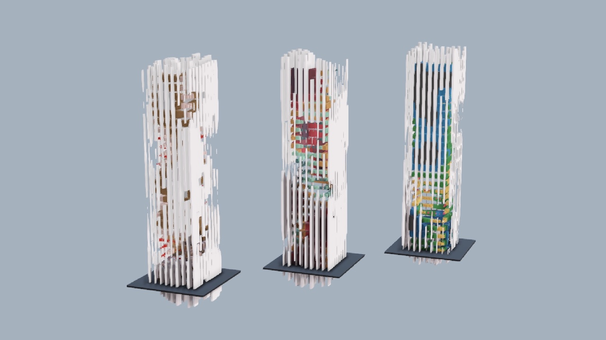

# nodes-stream
Source code for come of my https://nodes.io experiments streamed live.

## 2028-08-05 Cubes and Colors

 
Shows how to use pex-renderer nodes with instancing and color palettes.

Watch the video recording of the process: [Marcin's Nodes Stream - Cubes and Colors - 2021-08-05 8pm BST](https://www.youtube.com/watch?v=icrf5MQBB38&t=4s)

# License

The source code is release under MIT license. Please bear in mind though that Nodes is currently in open beta and if you would like to use it for commercial purposes please drop us a line at hello@nodes.io.
